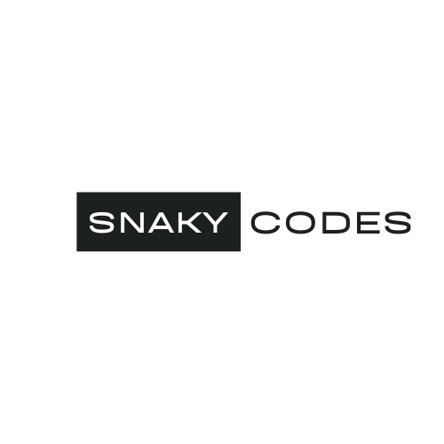

  
   

  <h3><b>Soban Syeed</b></h3>

# 📗 Table of Contents

- [📖 About the Project](#about-project)
  - [🛠 Built With](#built-with)
    - [Tech Stack](#tech-stack)
    - [Key Features](#key-features)
  - [🚀 Live Demo](#live-demo)
- [💻 Getting Started](#getting-started)
  - [Setup](#setup)
  - [Prerequisites](#prerequisites)
  - [Install](#install)
  - [Usage](#usage)
  - [Run tests](#run-tests)
  - [Deployment](#deployment)
- [👥 Authors](#authors)
- [🔭 Future Features](#future-features)
- [🤝 Contributing](#contributing)
- [⭐️ Show your support](#support)
- [🙏 Acknowledgements](#acknowledgements)
- [❓ FAQ (OPTIONAL)](#faq)
- [📝 License](#license)

# 📖 Hello Microverse! 

'Hello Microverse' is a my first Microverse project.

## 🛠 Built With 

Built using HTML and CSS.

### Tech Stack 

  
Client

  <ul>
    <li><a href="https://developer.mozilla.org/en-US/docs/Web/HTML">HTML</a></li>
    <li><a href="https://developer.mozilla.org/en-US/docs/Web/CSS">CSS</a></li>
  </ul>

### Key Features 

- Simple Web Page.

(<a href="#readme-top">back to top</a>)

## 🚀 Live Demo 

- Coming soon

(<a href="#readme-top">back to top</a>)

## 💻 Getting Started 

To get a local copy up and running, follow these steps.

### Prerequisites

In order to run this project you need:

A code editor

### Setup

Clone this repository to your desired folder:

  git clone https://github.com/SnakyMz/Hello-Microverse.git

(<a href="#readme-top">back to top</a>)

## 👥 Authors 

👤 Soban Syeed

- GitHub: [@githubhandle](https://github.com/SnakyMz)
- Twitter: [@twitterhandle](https://twitter.com/SobanSyeed)
- LinkedIn: [LinkedIn](https://www.linkedin.com/in/soban-syeed-82985b241/)

(<a href="#readme-top">back to top</a>)

## 🔭 Future Features 

- More CSS

- Maybe CSS frameworks

(<a href="#readme-top">back to top</a>)

## 🤝 Contributing 

Contributions, issues, and feature requests are welcome!

Feel free to check the [issues page](../../issues/).

(<a href="#readme-top">back to top</a>)

## ⭐️ Show your support 

> Write a message to encourage readers to support your project

If you like this project please follow me on linkedIn

(<a href="#readme-top">back to top</a>)

## 🙏 Acknowledgments 

I would like to thank Microverse

(<a href="#readme-top">back to top</a>)

## ❓ FAQ (OPTIONAL) 

- Why make this project?

  - Part of the journey to learn.

- What next?

  - Depends on Microverse.

(<a href="#readme-top">back to top</a>)

## 📝 License 

This project is [MIT](./LICENSE) licensed.

(<a href="#readme-top">back to top</a>)

